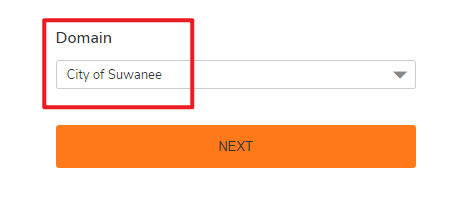
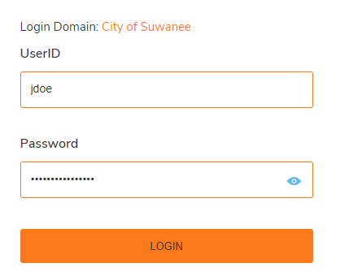
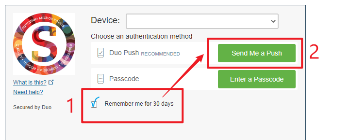
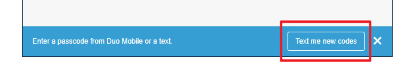
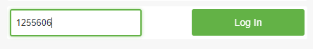
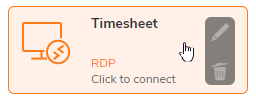
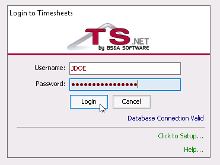

# Access Timesheets Online

## Signing In

- Open your web browser
- Go to [vpn.suwanee.com](https://vpn.suwanee.com)
- For **Domain** choose **City of Suwanee**

- For **UserID** type in only your username, don’t include `@suwanee.com`

- **Password** is the same as your computer login.

---

## MFA with Duo Authentication

- A Duo Authentication window will open. Click **Remember me for 30 days** and then click **Send Me a Push**.

>If a different window does not open then you need to enable pop-ups in your browser for [vpn.suwanee.com](http://vpn.suwanee.com)

>If you recieve codes via SMS then request a new code by clicking the **Text me new codes** button. Type in the **7-digit code** and click **Log In**

---

## Timesheet

- Click on **Timesheet** and the app will launch.
- Sign in using your same username.

>The **10-key numbers** on the right-hand side of the keyboard might not work inside the Timesheet module. Try using the numbers at the top of your keyboard.
