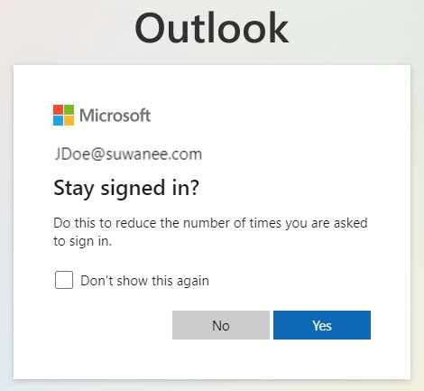

# Access Outlook Online

1. Open your web browser and navigate to [Outlook.com](https://outlook.com)
1. Click the **Sign in** button.

    

1. Type in your full Suwanee email. And click the **Next** button.

    

1. Enter your password and click the **Sign in** button.
1. You will then be redirected to another page to complete the 2 Factor Authentication using Duo.
1. A notification should appear on your phone for Duo Mobile. Type the code you see on your computer screen into the Duo Mobile App on your phone.

    

1. Once 2 Factor Authentication has been approved, you will be asked if this is your device. If other people use this computer then do not select **Yes, this is my device**.

    

1. Click **Yes** if you wish to stay singed in to your account.

    

1. You're done! You should now be able to send and receive Suwanee emails online.
