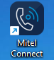
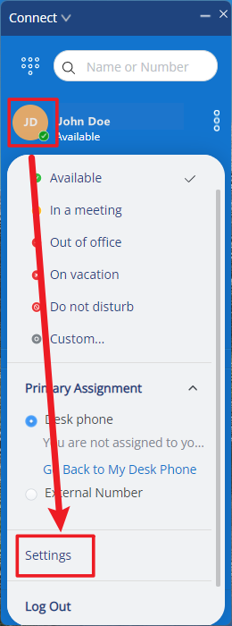
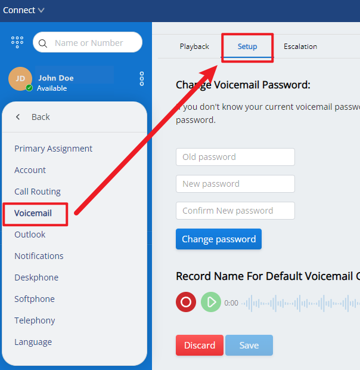

# Mitel - Record Voicemail

>Reference this document for help logging into Mitel: [Login to Mitel](Login%20to%20Mitel.md)

1. Open **Mitel Connect** on your Desktop.

    

1. Click on your **User’s initials** > **Settings**

    

1. Then click on **Voicemail** > **Setup**. You can then record your name at the bottom of the screen.

    
