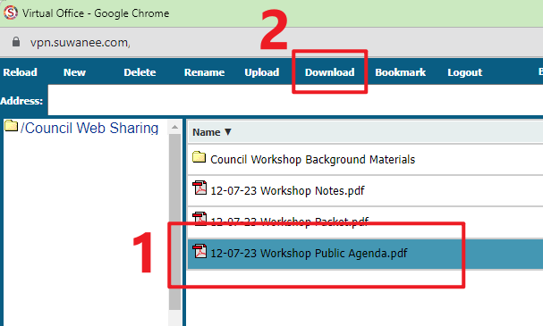

# Access Council Agenda

The Council Agenda can be accessed online and remotely by using the Suwanee Virtual Office.

## Signing In

- Open your web browser
- Go to [vpn.suwanee.com](https://vpn.suwanee.com)
- For **Domain** choose **City of Suwanee**

- For **UserID** type in only your username, don’t include `@suwanee.com`

- **Password** is the same as your computer login.

---

## MFA with Duo Authentication

- A Duo Authentication window will open. Click **Remember me for 30 days** and then click **Send Me a Push**.

>If a different window does not open then you need to enable pop-ups in your browser. Follow these instructions: [Enable Pop-ups in Chrome](../Miscellaneous/Enable%20Pop-ups%20in%20Chrome)

>If you recieve codes via SMS then request a new code by clicking the **Text me new codes** button. Type in the **7-digit code** and click **Log In**

---

## Council Web Sharing

- Click on **Council Web Sharing** bookmark and another window will open.

- Navigate to the **Agenda** folder.

- Inside the **Agenda** folder you will find the Council Meeting & Workshop files.
- Highlight the file you wish to download, then at the top of the page click **Download**. The file will now be downloaded to your local computer.

---

[Back to Main](../README.md)
